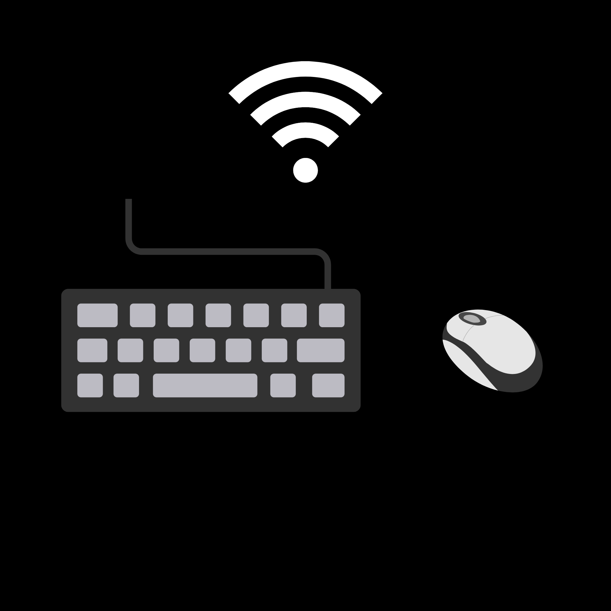
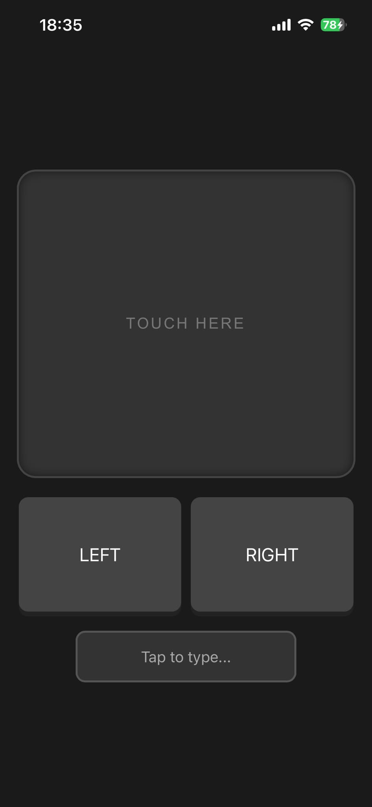

<div align="center">
  
  
  <h1>PC Remote Control</h1>
  
  <p>A minimal, fast, and local web-based remote control for PC</p>
  <p>

  
  

  
</p>
</div>

## ✨ Key Features

* **🖱️ Advanced Trackpad:** Smooth and responsive mouse control, including built-in long-press support on the left click (ideal for dragging items or highlighting text).
* **📜 Two-Finger Scrolling:** Dedicated two-finger scroll functionality directly on the trackpad interface for effortless web and document navigation.
* **⌨️ Full Keyboard Integration:** Real-time typing directly from your phone, fully supporting special keys and continuous typing.
* **🚀 Smart Command Mode:** Use the smart backslash `\` prefix to instantly send full sentences or execute quick system shortcuts (like Copy, Paste, or Mute) directly from your phone.
* **⚡ Zero Latency:** Runs entirely on your local network (or via Mobile Hotspot) for an instant, lag-free experience without relying on external servers.
* **📱 Native App Experience:** A clean user interface. Use the "Add to Home Screen" option on your phone to launch it in full-screen mode like a real app.

## 💻 Technologies Used

* **Backend:** Built with **Python 3.x** utilizing the **Flask** micro-framework to run the local web server.
* **Automation & Control:** Uses **pynput** to simulate real-time keyboard inputs, mouse movements, clicks, and scrolling on the host operating system.
* **Frontend:** Developed using pure **HTML**, **CSS**, and **JavaScript** to capture touch gestures, trackpad movements, and keystrokes with zero external dependencies.

## 📦 Installation

Make sure you have Git and Python (3.x) installed on your computer.
Open your Command Prompt or Terminal and run the following commands:

```bash
# Clone this repository
git clone https://github.com/nivk7/PC-Remote-Control.git

# Go into the repository
cd PC-Remote-Control

# Install libraries
pip install -r requirements.txt

# Run app
python main.py
```
Note: Depending on your operating system and Python setup, you might need to use python3 and pip3 instead of python and pip.

## 🚀 Usage

1. **Find your Local IP:** Once the server is running (`python main.py`), look at your terminal. Flask will print the local network address you need to use (usually looking like `http://192.168.x.x:5000`).
2. **Connect from your Phone:** Open your mobile web browser and enter that exact URL. *(Make sure both devices are on the same network or hotspot).*
3. **Install as a Native App (Recommended):** For the best, full-screen zero-latency experience without the browser's address bar:
   * **iOS (Safari):** Tap the Share button at the bottom and select **"Add to Home Screen"**.
   * **Android (Chrome):** Tap the three dots menu at the top right and select **"Add to Home screen"**.
4. **Take Control:** Launch the app from your home screen. You can now use the trackpad, open the keyboard, and utilize the `\` smart command mode!

> **💡 Pro Tip: Use your Computer's Hostname**
>
> Tired of checking your new IP address every time you switch networks? You can often bypass the IP entirely by using your computer's network name!
>
> Just type `http://YOUR-PC-NAME.local:5000` in your phone's browser (replace `YOUR-PC-NAME` with your actual Windows/Mac computer name).

### ⌨️ Keyboard Shortcuts & Commands

The smart keyboard feature allows you to send full sentences or execute system shortcuts using the backslash (`\`) prefix.

| Command Type | Prefix | Description | Example |
| :--- | :--- | :--- | :--- |
| **Full Sentence** | `\ ` (with space) | Type a full sentence on your phone and send it all at once. | `\ Hello World!` |
| **System Shortcut** | `\` (no space) | Execute keyboard combinations or special keys. | `\ctrl+c` (Copy) |

**Supported System Shortcuts:**
* `\ctrl+c` / `\ctrl+v` - Copy and Paste
* `\alt+f4` - Close the current window
* `\cmd+tab` - Switch between open applications
* `\desktop` - Show desktop
* `\cmd` - Open Start/Command menu
* `\volume_up` / `\volume_down` / `\mute` - Adjust or mute media volume

<br>
<div align="center">
  
  <p><em>The PC Remote Control interface on a mobile browser</em></p>
</div>

## 🛠️ Troubleshooting & Common Issues

* **Browser forces HTTPS (Connection Refused):** This local server runs on standard HTTP. If your phone's browser automatically redirects to `https://`, the connection will fail. Make sure to explicitly type `http://` before your IP address (e.g., `http://192.168.1.15:5000`).

* **Cannot connect on Public Wi-Fi:** Public networks (cafes, libraries, universities) often block device-to-device communication for security reasons. 
**Solution:** Turn on a Mobile Hotspot from your PC or phone and connect the other device to it. This bypassing the block and also ensures a zero-latency experience!

* **Mobile Hotspot not showing up on phone:** Windows often defaults to broadcasting the hotspot at 5GHz, which many phones fail to detect or connect to reliably in a local setup.
**Solution:** Go to Windows Settings -> Network & Internet -> Mobile Hotspot. Click **Edit** under properties, change the **Network band** from 5GHz (or "Any available") to **2.4 GHz**, save, and turn the hotspot off and on again.

## 🤝 Feedback & Contributing

Contributions, issues, and feature requests are welcome! 
If you find a bug, have a question, or want to suggest an improvement, feel free to [open an issue](https://github.com/nivk7/PC-Remote-Control/issues).

## 📫 Contact

**Niv**
* **Email:** [nivkalbo1@gmail.com](mailto:nivkalbo1@gmail.com)
* **GitHub:** [@nivk7](https://github.com/nivk7)

## 📄 License

This project is open-source and available under the [MIT License](LICENSE).